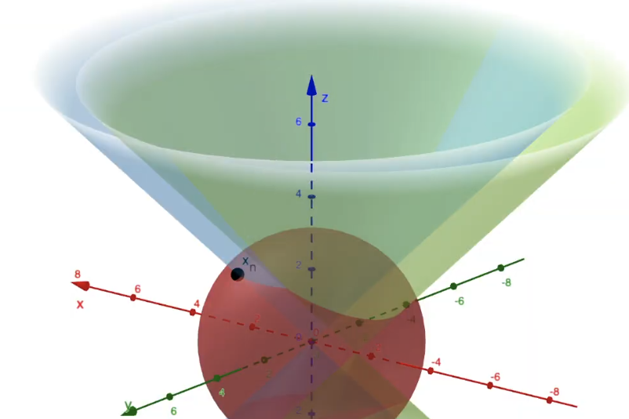
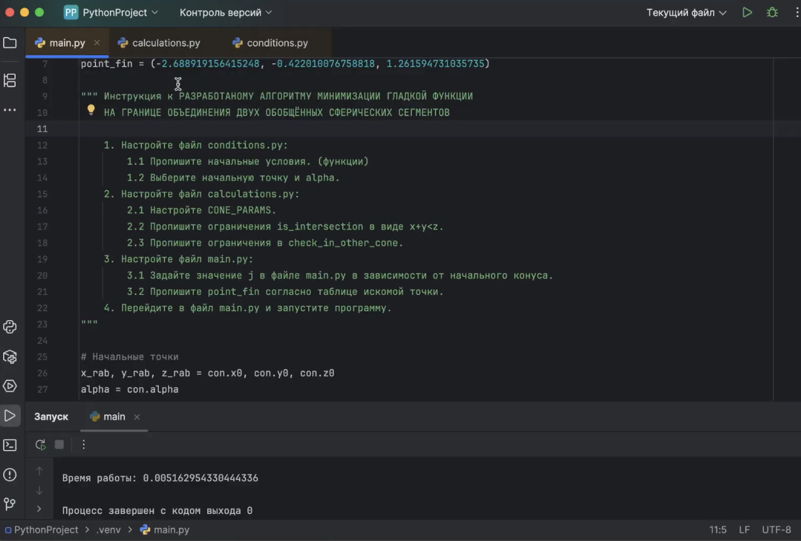

# Minimization-algorithm

Реализация алгоритма минимизации на границе объединения двух обобщённых сферических сегментов. (Магистерская диссертация)

Документация: Отчёт.pdf

## About

Работа исследует объединение множеств и находит решение задачи минимизации функции в области локального поиска при заданной точности.

## How it work

> Для запуска программы Вам будет необходима среда разработки PyCharm. Также предустановленые библиотеки, которые указаны в разделе 3.1 "Выбор средств инструментальнов разработки". Далее скопируйте код для случая 3D, создайте необходимые модули и пропишите начальные условия Вашей задачи. Готово, алгоритм можно запускать!

## Example

  
  

Демонстрация работы программы: https://docs.google.com/videos/d/1ulYs8ceaiGsb6CD6gi9_gwsyC0JdZ6J26YNYXN5INlY/edit?usp=sharing

## Support

tg: @swissmer